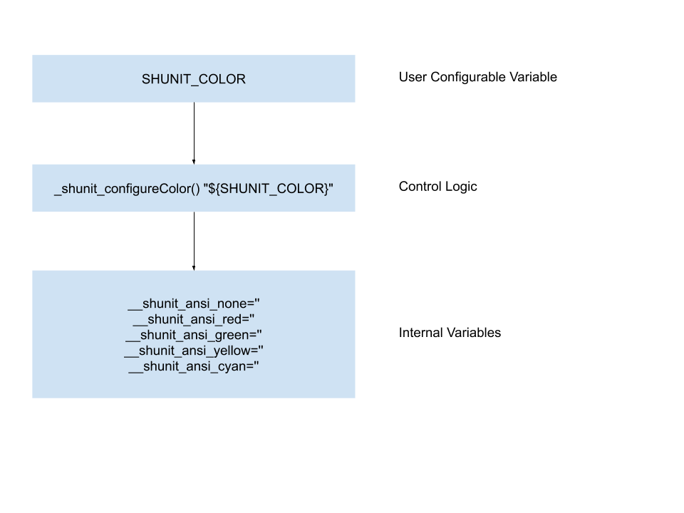

# Introduction

This document dissects `SHUNIT_COLOR` environment variable related logic at the source code level.


# Dissection



``` bash
# Enable color output. Options are 'never', 'always', or 'auto'.
SHUNIT_COLOR=${SHUNIT_COLOR:-auto}
```
> Receive configuration from user through environment variable.

<br/><br/>

``` bash
# ANSI colors (populated by _shunit_configureColor()).
__shunit_ansi_none=''
__shunit_ansi_red=''
__shunit_ansi_green=''
__shunit_ansi_yellow=''
__shunit_ansi_cyan=''
```
<br/><br/>

``` bash
# colors returns the number of supported colors for the TERM.
_shunit_colors() {
  _shunit_tput_=`${SHUNIT_CMD_TPUT} colors 2>/dev/null`
  if command [ $? -eq 0 ]; then
    echo "${_shunit_tput_}"
  else
    echo 16
  fi
  unset _shunit_tput_
}
```

<br/><br/>

``` bash
# configureColor based on user color preference.
#
# Args:
#   color: string: color mode (one of `always`, `auto`, or `none`).
_shunit_configureColor() {
  _shunit_color_=${SHUNIT_FALSE}  # By default, no color.
  case $1 in
    'always') _shunit_color_=${SHUNIT_TRUE} ;;
    'auto')
      command [ "`_shunit_colors`" -ge 8 ] && _shunit_color_=${SHUNIT_TRUE}
      ;;
    'none') ;;
    *) _shunit_fatal "unrecognized color option '$1'" ;;
  esac

  case ${_shunit_color_} in
    ${SHUNIT_TRUE})
      __shunit_ansi_none=${__SHUNIT_ANSI_NONE}
      __shunit_ansi_red=${__SHUNIT_ANSI_RED}
      __shunit_ansi_green=${__SHUNIT_ANSI_GREEN}
      __shunit_ansi_yellow=${__SHUNIT_ANSI_YELLOW}
      __shunit_ansi_cyan=${__SHUNIT_ANSI_CYAN}
      ;;
    ${SHUNIT_FALSE})
      __shunit_ansi_none=''
      __shunit_ansi_red=''
      __shunit_ansi_green=''
      __shunit_ansi_yellow=''
      __shunit_ansi_cyan=''
      ;;
  esac

  unset _shunit_color_ _shunit_tput_
}
```
> `_shunit_color_` here is used as a flag within a function.

<br/><br/>


``` bash
# Configure default output coloring behavior.
_shunit_configureColor "${SHUNIT_COLOR}"
```
